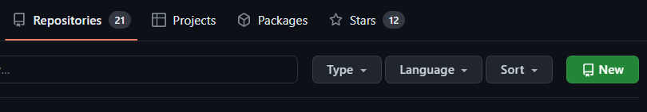
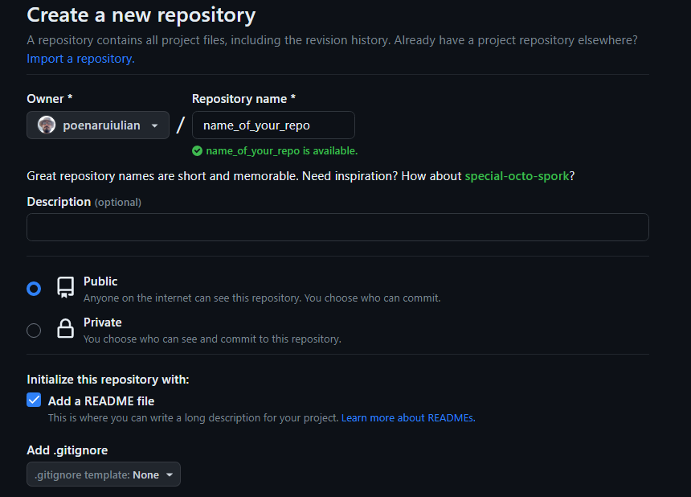

# Git/Github 

Below there are presented and somehow explained some of the basic Git commands. Feel free to use this repo to test the commands, but `please don't modify the README.md file or images folder and its components`.

## How to create a new repo

To create a repository go to you repositories and click on `NEW`.

After that give you repo a name and a check the **Add a README file**. Readme files are very important because they should contain the description of your app.

Now you have a blank repo.

## How to add files in your remote repo

First of clone the repo on your computer using the command `git clone <LINK OF THE REPO`. The link you can get it by going on the repo page and copy paste it from there.

After cloning ther repo add the files you want to be on your remote repository. When you want to sync the remote repo with the local one you will go trough 3 stages:
- adding stage
- commit stage
- push stage

To add all files type `git add .`, then for commiting the changes type `git commit -m " <MESSAGE REGARDING YOUR CHANGES> "` and then you need to push your changes form local repo to remote repo using `git push origin <BRANCH NAME>`. <BRANCH NAME> represents the name of the branch you want to push.

## Creating new branches

To create a new branch type `git branch ' <BRANCH NAME> '`. And if you want to add your work on that branch, before adding and merging, you need to checkout using `git checkout <BRANCH NAME>`.

For more details:
- [Video](https://www.youtube.com/watch?v=DVRQoVRzMIY&t=149s&ab_channel=TechWithTim)
- [Docs](https://git-scm.com/docs)
